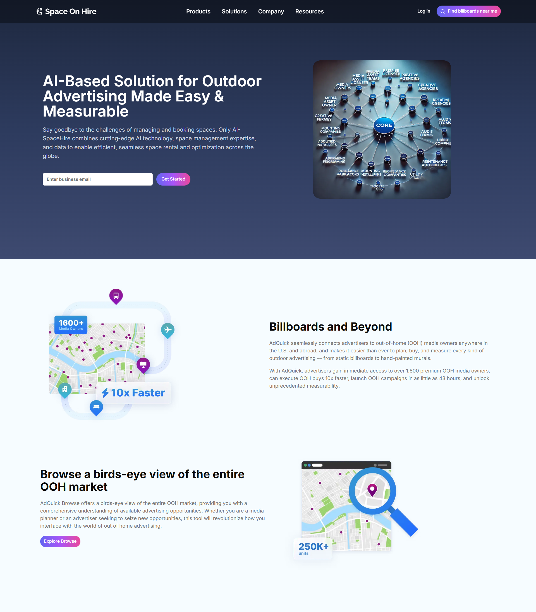
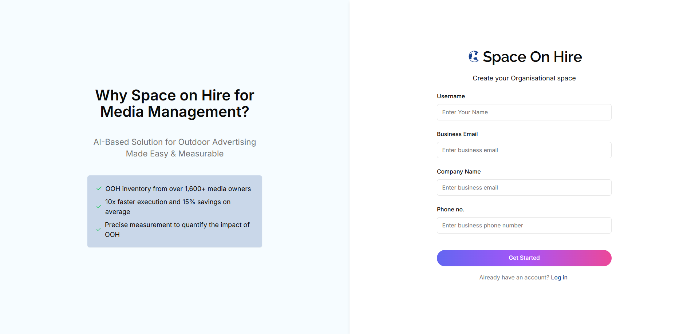
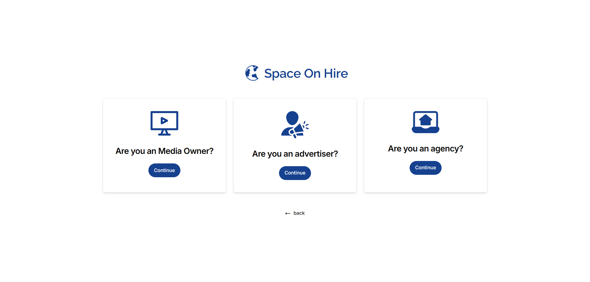
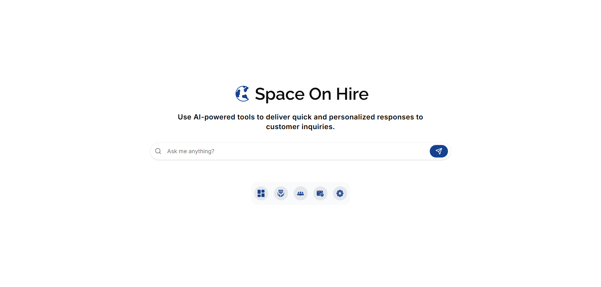
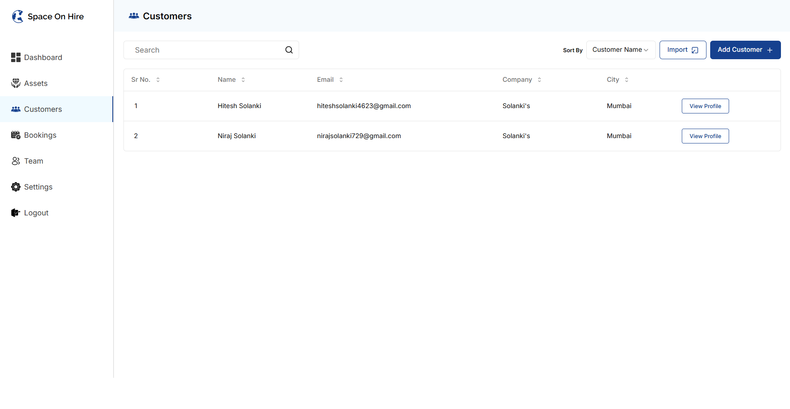
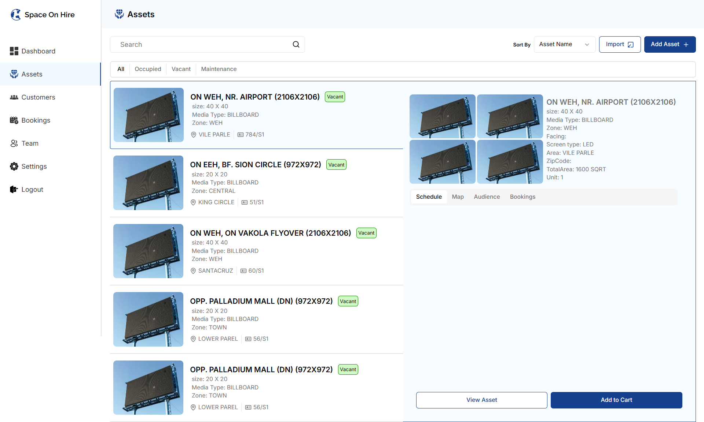
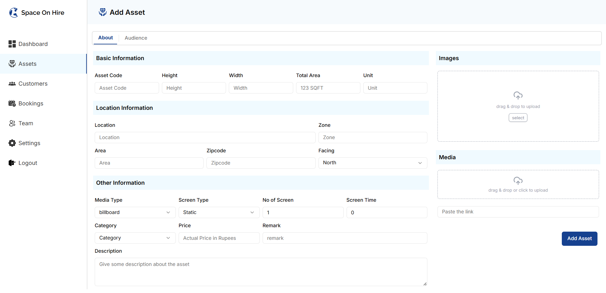

# 🌐 Space On Hire

**One Solution for OOH (Out-of-Home) Media Management**

---

## 📌 Overview

**Space On Hire** is an AI-powered platform built to streamline and simplify outdoor advertising management. It provides a unified solution for media owners, advertisers, and agencies to manage assets, bookings, customer data, and analytics through a powerful CRM system.

---

## 💡 Features

- 🔍 **Smart Asset Management**  
  Effortlessly add, edit, and manage media assets like billboards and digital screens.

- 🧠 **AI-Driven Recommendations**  
  Leverage intelligent tools for campaign suggestions, pricing optimization, and audience targeting.

- 📦 **Inventory & Status Tracking**  
  Monitor asset availability in real-time with status filters like Occupied, Vacant, and Maintenance.

- 👥 **Customer CRM Module**  
  Store and manage customer profiles, companies, and booking histories.

- 🚀 **Role-Based User Flow**  
  Dedicated onboarding for Media Owners, Advertisers, and Agencies.

- 📅 **Booking and Scheduling**  
  Allocate screen time, manage pricing, and streamline reservations.

- 🌍 **Landing Page & Marketing**  
  High-converting marketing page highlighting platform benefits and client success stories.

---

---

## 📸 UI Screenshots

### Landing Page



### Auth Page



### Business Type Selection



### AI Chat Assistant



### Customer Directory



### Asset Listing Dashboard



### Add Asset Page



---

## 🖼️ UI Highlights

- **Add Asset Panel**: Enter dimensions, location, pricing, media type, and upload images or videos.
- **Asset Dashboard**: View all available media spaces with preview thumbnails and filters.
- **Customer Directory**: Search and manage all registered businesses and contacts.
- **AI Assistant**: Ask questions and receive instant campaign insights.
- **Auth Flow**: Guided registration with business role selection and secure login.

---

## 🛠️ Tech Stack

- **Frontend**: React.js, Next.js, Tailwind CSS
- **Backend**: Node.js, Express.js (assumed)
- **Database**: MongoDB or PostgreSQL (assumed)
- **Authentication**: JWT / Session-based auth
- **AI**: OpenAI APIs for chat and recommendations
- **Cloud & DevOps**: AWS (S3 for media), Docker, GitHub Actions

---

## 🚀 Getting Started

Clone the project and run it locally:

```bash
git clone https://github.com/your-org/space-on-hire.git
cd space-on-hire-fe
npm install
npm run dev
```

## ✍️ Authors

- **Hitesh Solanki** – [hiteshsolanki4623@gmail.com](mailto:hiteshsolanki4623@gmail.com)

---

## 📬 Contact

For enterprise demo or queries:
📧 Email: [hiteshsolanki4623@gmail.com](mailto:hiteshsolanki4623@gmail.com)

---

## 🚧 Work in Progress

- [ ] Backend Integration
- [ ] Integrating campaign analytics
- [ ] Expanding AI recommendation system
- [ ] Map view for asset discovery
- [ ] Mobile responsiveness for all pages

---

> **_Project Status: Work in Progress_ 🚧**

```

```
